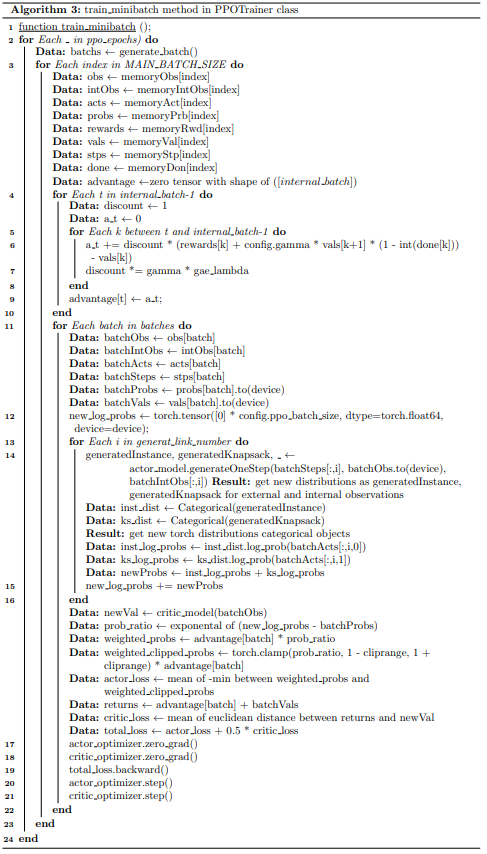

# :zap:MKP-RL:zap:

## :bookmark: 1- Introduction

In this GitHub repository, we present a new approach to solving the multi-dimensional multiple knapsack problem. This work stems from my master's thesis focused on resource management in cloud computing. To investigate and test my thesis, I initially conducted experiments using a simplified environment, prior to considering the complexities inherent in cloud computing resource management. The primary objective of our project is to train a transformer model using reinforcement learning algorithms, such as Proximal Policy Optimization (PPO). We have implemented two variants of PPO for this purpose.

The ultimate goal of this project is to leverage the trained transformer model to effectively highlight the object-knapsack connections during various stages of the problem-solving process. By addressing the multi-dimensional multiple knapsack problem, we aim to contribute to the advancement of cloud computing resource management techniques.

The knapsack problem refers to a classic optimization problem where a set of objects, each characterized by a weight and value, must be packed into a limited-capacity knapsack. The objective is to maximize the total value of the chosen objects while adhering to the constraint of not exceeding the knapsack's weight limit. Intriguingly, the knapsack problem exhibits similarities to resource management in cloud computing, where cloud resources must be efficiently allocated to optimize performance and cost.

While this project demonstrates great potential, :bug: there is an issue or bug that needs to be addressed. As specified in the issues section, the current problem lies in the model's training, which does not yield satisfactory performance. By sharing the issue details, I hope to collaborate with others and collectively find a solution. :rocket:

## :bookmark: 2- Proposed Reinforcement System
### 1-2- RL & PPO Background
Reinforcement learning is a type of machine learning where an agent learns to make decisions by interacting with an environment. The agent receives feedback in the form of rewards or penalties based on its actions and uses this feedback to improve its decision-making abilities over time. The goal is to find the optimal policy that maximizes the cumulative rewards obtained from the environment.

Proximal Policy Optimization (PPO) is a popular algorithm used in reinforcement learning. PPO is designed to optimize the policy, which is the strategy used by the agent to make decisions. It is an on-policy method, meaning it collects data by interacting with the environment using the current policy.

PPO uses a surrogate objective function to estimate the loss between the new policy and the old policy. It then applies optimization techniques to update the policy in a way that maximizes the expected rewards while ensuring that the policy update is not too large. By gradually improving the policy through multiple iterations, PPO is able to find a locally optimal policy.

PPO has gained attention due to its ability to strike a balance between sample efficiency and stability. It avoids the need for value function approximation and provides an easy-to-use algorithm for reinforcement learning tasks.

### 2-2- RL System Model
**STATE:** In our system model, each state is perceived as an external observation represented by a 3D matrix. The first dimension comprises all information related to one problem (our methodology allows for the inclusion of multiple problems). The second dimension accommodates the maximum input size of the transformer model, which is equal to the sum of the instanceobservationsize, knapsackobservationsize, and 3. Lastly, the third dimension contains information regarding instances and knapsacks, incorporating all n-dimensional instances along with an additional dimension for value, followed by all knapsack n-dimensions and an extra dimension filled with zeroes.

Within the third dimension of the state, we introduce three tokens: SOD (start of data), EOD (end of data), and PAD. SOD is represented by an n+1-dimensional vector with all dimensions filled with 1, serving as the start token. Conversely, EOD is an n+1-dimensional vector with all dimensions set to 2, functioning as the end token and separating the instance and knapsack data. In cases where the number of remaining instances in a state is less than instanceobservationsize, we incorporate PAD tokens (n+1-dimensional vector with all dimensions set to 0) before the SOD token.

**ACTION:** Every action in this system consists of two parts. The first part involves selecting an instance through the instance-observation-size actions, while the second part involves choosing a knapsack through the knapsack-observation-size actions. In other words, the action serves as a connection between an instance and a knapsack in our system.

**REWARD-FUNCTION:** Firstly, if the chosen instance is in the PAD (Partial Assignment Database) section of the external observation or if it belongs to the accepted actions from previous steps, the agent receives a reward of -(Highest_value/(5 * lowest_weight). Secondly, if the chosen instance is successfully allocated in the knapsack, the agent is rewarded with +(instance_value / sum(instance_weights)). Lastly, if the chosen instance cannot be allocated in the knapsack, the model receives a penalty of -(lowest_value).

### 3-2- Actor Deep Models
We have introduced two transformer models as reinforcement actor in our project. :heavy_check_mark: Transformer Model and :heavy_check_mark: Encoder-Mlp Model

#### 1-3-2- Transformer Model
The first model is a Encoder-Decoder pytorch transformer model. In this model, each state (or external observation) is sent as input to the encoder, and every accepted action is added to the decoder prompt as an internal observation to generate new output. The output of the decoder is divided into two parts. The first part is sent to a linear layer with a softmax activation function to determine the first part of the action (choosing an instance), while the second part is sent to another linear layer with softmax to determine the second part of the action (choosing a knapsack).

#### 2-3-2- Encoder-Mlp Model
The second model is an Encoder-MLP model, introduced to test the functionality of the models. This model consists of a transformer Encoder and an MLP model. The external observation is passed through the Encoder, and the output of the encoder is then sent to the MLP model. The output of the MLP is divided into two parts, similar to the transformer model, and sent to two different linear models with softmax activation functions.

Unlike the transformer model, in the Encoder-Transformer model, we can only take one inner step, and we must update the state (external observation) after each choice of action. The concept of internal observation becomes meaningless in this model.

### 4-2- RL Algorithms
#### 1-4-2- PPO
We utilize the PPO algorithm as the foundation for our reinforcement learning framework in the initial development phase. To enhance the capabilities of our system, we customize the PPO algorithm in two ways to incorporate the Transformer model as an actor model. These customized algorithms, named 'Fraction_PPO_Trainer' and 'PPO_Trainer,' are further explained in this section. While there are similarities between both algorithms, there are also differences.

In each step, the environment's state is sent to the 'make_step' method as an external observation. Within this method, the Transformer model generates links between instances and knapsacks as the actor model. If an instance is successfully allocated in a knapsack, the prompt tensor is updated. This prompt tensor serves as the target in the Transformer decoder and as the internal observation in our ppo algorithms. As our actions consist of two parts, the probability of these actions is determined by multiplying the probabilities of each part. The log probability is then calculated as the sum of the log probabilities of each part.

Additionally, both algorithms have corresponding critic models, which we will also explain.

**PPO_Trainer:** This algorithm considers all generated links as one step and accumulates the sum of internal rewards and probabilities in "make_step" for the training step. After the 'makestep' method, we have multiple actions but only one reward and one set of probabilities. These actions are utilized in a loop during the training step to calculate the sum of new log probabilities for the PPO algorithm. The internal observation obtained in the 'make_step' method is used to obtain new distributions in the training step. However, since there is only one reward in this algorithm, the internal observation is not utilized in the critique model. In this algorithm, the critic model is an LSTM_MLP model that takes the external observation as input to provide value critics for our Transformer model.

**Fraction_PPO_Trainer:** In contrast to the "PPO_Trainer" algorithm, the "Fraction_PPO_Trainer" returns the reward and log probability for each generated link separately. Therefore, each action is treated as an individual element in the training step. Given the same external observation for a group of elements, the internal observation plays a crucial role in predicting values with critic model. Consequently, the critic model in this algorithm is an MLP model with two inputs: the external observation and the internal observation."

## :bookmark: 3- Experiment

### 1-3- Data Format and Preprocessing part

### 2-3 Training Process

## :bookmark: 3- Issue
